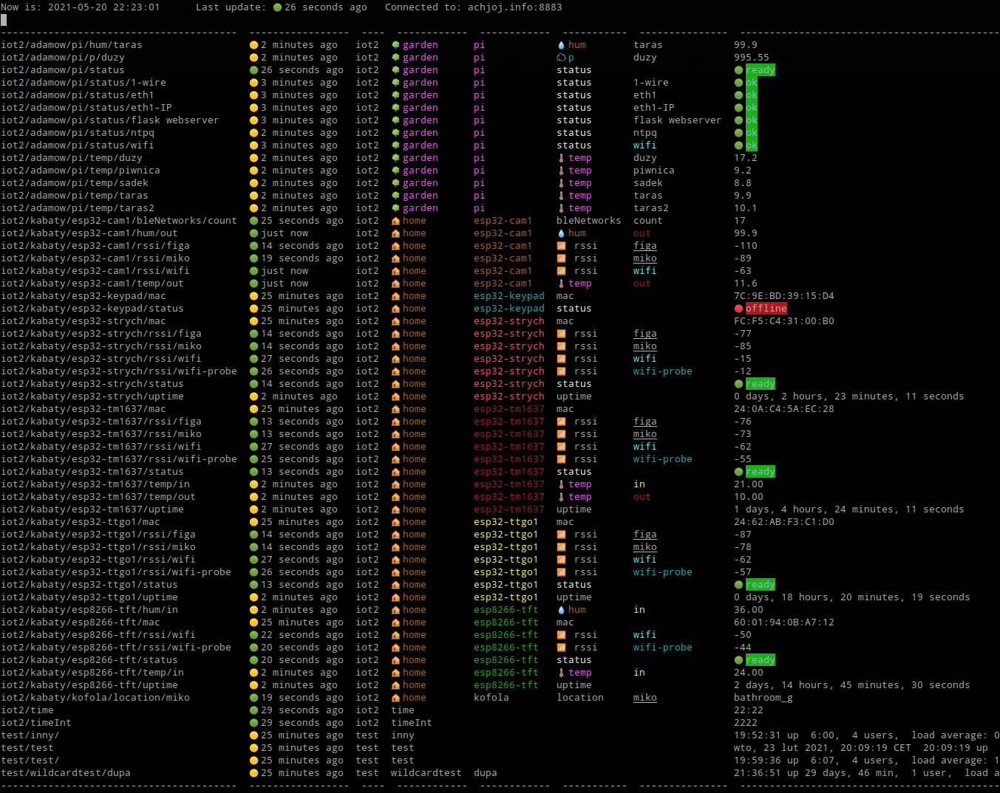

# mqtt-monitor

This is a simple mqtt topic monitor written in python 3. It allows you to subscribe and listen to a number of mqtt topics and display it in a form of table. Optionally it adds some colors to the presented data.



# Installation

`git clone git@github.com:filipsPL/mqtt-monitor.git`

## With conda

```
conda env create -f conda.yml
conda activate mqttmonitor
```

## With pip

`pip install paho-mqtt pandas tabulate`


# Usage

- create a conf file from template `cp mqtt_conf.py.sample mqtt_conf.py`
- edit
