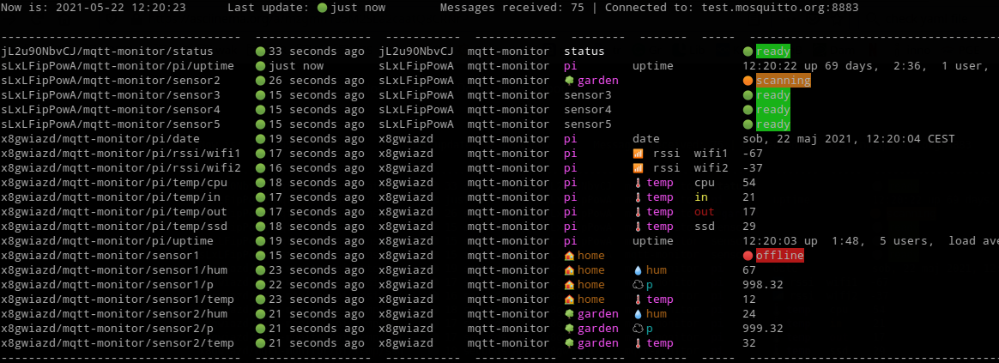

<!-- TOC START min:1 max:6 link:true asterisk:false update:true -->
- [About mqtt_monitor](#about-mqtt_monitor)
- [Installation](#installation)
  - [With conda](#with-conda)
  - [With pip](#with-pip)
- [Usage](#usage)
  - [Test server](#test-server)
  - [Set up your own config](#set-up-your-own-config)
- [Screencast](#screencast)
<!-- TOC END -->


# About mqtt_monitor

This is a simple mqtt topic monitor written in python 3. It allows you to subscribe and listen to a number of mqtt topics and display it in a form of table. Optionally it adds some colors to the presented data.



It was tested (under GitHub Actions CI/CD) and works under:
- OS: Ubuntu, MacOS, and Windows
- Python versions: 3.5, 3.8, and 3.9


[](https://github.com/filipsPL/mqtt-monitor/actions/workflows/python-app.yml)


# Installation

`git clone git@github.com:filipsPL/mqtt-monitor.git`

## With conda

```
conda env create -f conda.yml
conda activate mqttmonitor
```

## With pip

`pip install -r requirements.txt`

# Usage

## Test server

Connect to the test server and wait for messages:

`./mqtt_monitor.py --conf mqtt_monitor.conf.sample`

## Set up your own config

- create a conf file from template `cp mqtt_monitor.conf.sample mqtt_monitor.conf`
- edit `mqtt_monitor.conf`
- run `./mqtt_monitor.py --conf mqtt_monitor.conf`
- enjoy


# Screencast

See the monitor in action:

[](https://asciinema.org/a/mzgmn185M2SLa2caatQ8CRNrP)
